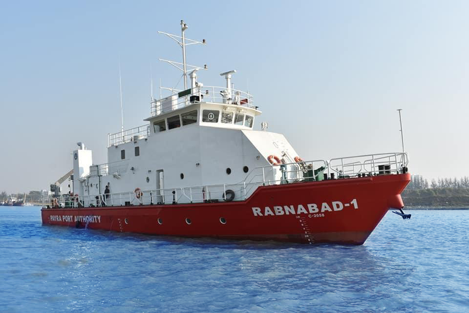

# 🚤 02 × Heavy Duty Speed Boats (HDSB)

  

<h2 align="center">02 × Heavy Duty Speed Boats (HDSB)</h2>

<b>Payra Port Authority (PPA)</b> 
Naval Architect | Design Review | Design Management | Class Compliance

---

## 📌 Project Summary

Successfully delivered **02 × Heavy Duty Speed Boats (HDSB)** for the **Payra Port Authority (PPA)** in **2019**. Designed as multi-purpose patrol and response vessels, the boats support coastal and harbor security, search and rescue, anti-piracy, anti-smuggling, anti-drug trafficking, and emergency response operations. My responsibilities included design review, engineering management, class compliance, technical coordination, construction support, and successful delivery of both vessels.

| **Client** | Payra Port Authority (PPA) |
|:-----------|:---------------------------|
| **Project** | 02 × Heavy Duty Speed Boats |
| **Role** | Naval Architect |
| **Delivery** | **2019** |

---

## 📐 Principal Particulars

| Parameter | Value |
|:----------|------:|
| Length Overall (LOA) | **33.00 m** |
| Breadth | **6.92 m** |
| Depth | **3.70 m** |
| Draft | **2.00 m** |

---

## ⚓ Operational Capabilities

- Coastal patrol and harbor security operations.
- Anti-piracy, anti-smuggling, and anti-drug trafficking surveillance.
- Search and Rescue (SAR) operations in inland and coastal waters.
- Rescue of persons overboard.
- Assistance to vessels during emergency and damage control situations.
- Continuous **24-hour operational capability** for maritime security missions.

---

## 👨‍💼 Engineering Contributions

- Reviewed vessel design against contractual specifications, operational requirements, and applicable regulations.
- Managed engineering deliverables and coordinated multidisciplinary design activities throughout the project lifecycle.
- Verified compliance with classification society rules, statutory regulations, and client technical specifications.
- Reviewed hull structural, machinery arrangement, outfitting, and production drawings for technical accuracy and constructability.
- Coordinated technical discussions between the client, design consultants, production departments, equipment suppliers, and class surveyors.
- Managed engineering changes and resolved technical issues arising during construction.
- Supported inspections, harbor acceptance tests, sea trials, commissioning, and final delivery.
- Ensured engineering quality, configuration control, technical compliance, and on-time completion of both vessels.

---

## ⭐ Technical Expertise Demonstrated

**Ship Design Review • Design Management • Engineering Coordination • Structural Engineering • Production Engineering • Technical Documentation • Contract Compliance • Class Compliance • Construction Support • Technical Problem Solving • Quality Assurance • Sea Trials & Commissioning**

---

## 💻 Engineering Software

**AVEVA Marine • AutoCAD • Maxsurf • Rhino3D • ANSYS**

---

## 📬 Contact

**Md. Ariful Islam**

**Senior Naval Architect | Ship Design | Structural Engineering | Design Management | Project Management | Classification Compliance**

📧 **ariful.buet1985@gmail.com**

💼 **https://linkedin.com/in/islam-mdariful**

---

<b>Delivering High-Performance, Mission-Ready, and Class-Compliant Maritime Security Vessels.</b>

